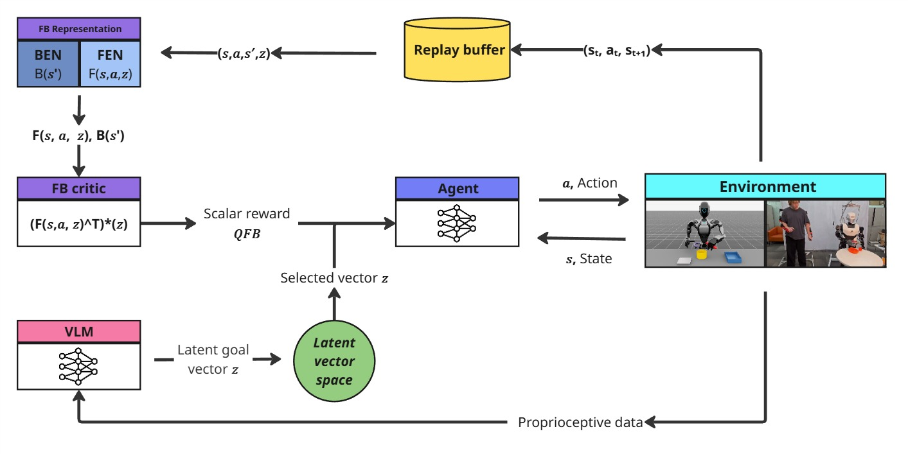

# Behavior Foundation Model for humonoid robots

This project presents a development framework for training a Behavior Foundation Model (BFM), including core modules, training pipeline, and a vision-language-conditioned goal interface. It also includes sample model definitions for agent behavior and latent representation learning.

**Data stream loader + MetaMotivo(BFM) core + Isaac Lab wrapper + vision/language adapters**

# Dataset  used in project 

https://huggingface.co/datasets/b4r4d41z/Bimanual-humanid-tasks

